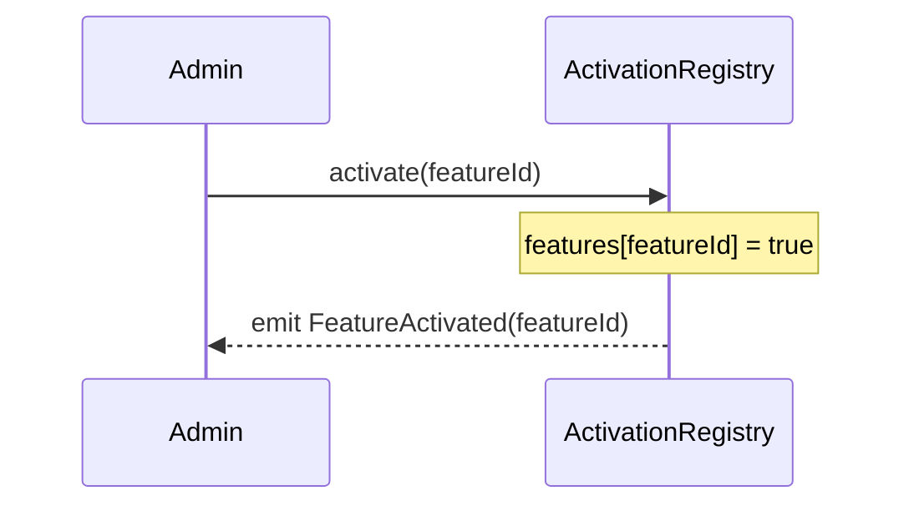
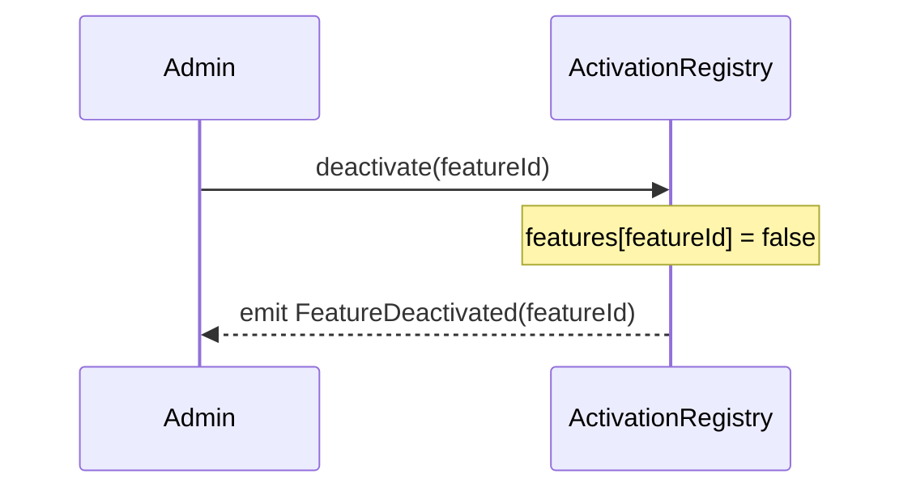

# ActivationRegistry

The ActivationRegistry tracks which Base features are live. This is managed exclusive by the Base and integrators don't typically need to query it. See [`IActivationRegistry`](../../src/interfaces/IActivationRegistry.sol) for the full Solidity interface.

## Feature IDs

Feature IDs are opaque `bytes32` values. By convention each is the keccak256 digest of a human-readable feature name (e.g., `keccak256("base.b20_asset")`); a feature ID is permanently bound to its semantic and is never recycled.

The canonical IDs in use today, defined in [`ActivationRegistryFeatureList`](../../test/lib/mocks/ActivationRegistryFeatureList.sol):

| Constant | Preimage | Value |
|---|---|---|
| `B20_FACTORY` | `"base.b20_factory"` | `0x78751e29c8bcc0d609ab18e9fbc4158e73f7db25ae2ee095dad42e2578b1e800` |
| `B20_ASSET` | `"base.b20_asset"` | `0xcdcc772fe4cbdb1029f822861176d09e646db96723d4c1e82ddfdeb8163ef54c` |
| `B20_STABLECOIN` | `"base.b20_stablecoin"` | `0xecfa0def2c10020caaf65e6155aa69c84b24892aaef76eeac52e0e2b3a0b8601` |
| `POLICY_REGISTRY` | `"base.policy_registry"` | `0xb582ebae03f16fee49a6763f78df482fb11ae73f103ed0d330bbe556aa90a43f` |

## User Flows

### Activate Feature

The admin marks a feature as live; downstream consumers can immediately observe the change.

Reverts: `Unauthorized` (non-admin caller), `AlreadyActivated`, `DelegateCallNotAllowed` / `StaticCallNotAllowed`.

### Deactivate Feature

The admin marks a previously-active feature as inactive.

Reverts: `Unauthorized`, `AlreadyDeactivated`, `DelegateCallNotAllowed` / `StaticCallNotAllowed`.
