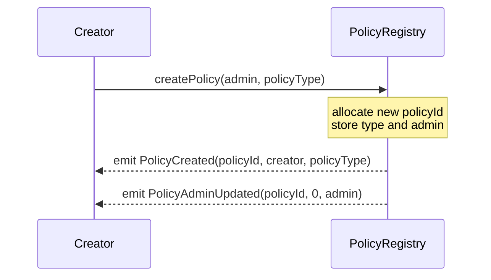
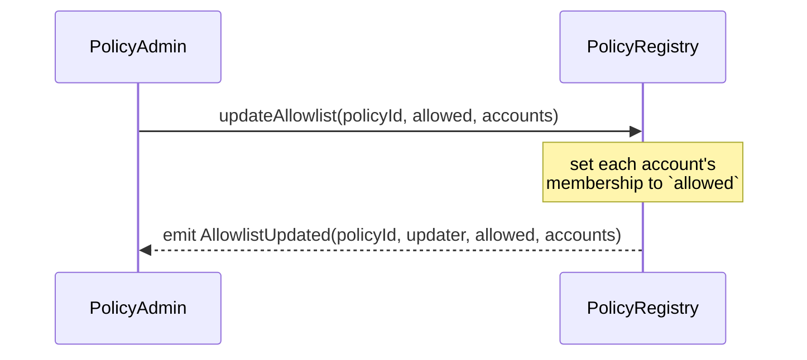
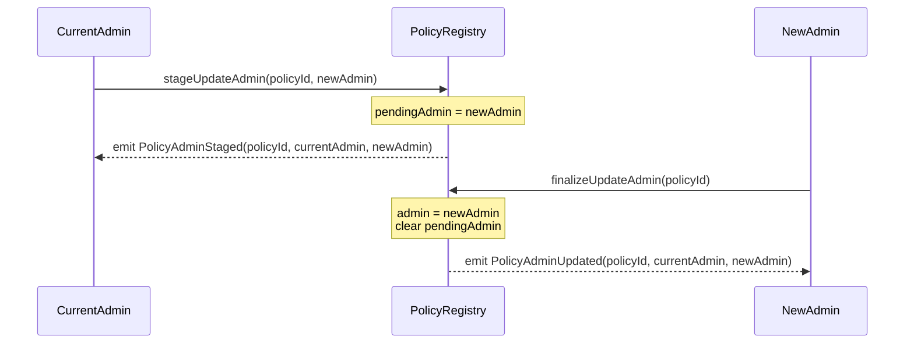
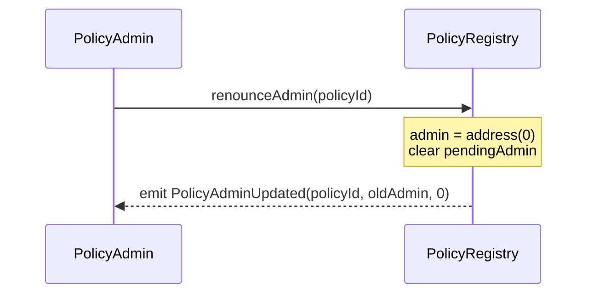

# PolicyRegistry

The PolicyRegistry is a singleton precompile for list-based access policies — allowlists and blocklists. Any caller can create a policy and nominate its admin; B20 tokens and other consumers reference policies by `uint64` ID for authorization checks. See [`IPolicyRegistry`](../../src/interfaces/IPolicyRegistry.sol) for the full Solidity interface.

## Policy Types

Two policy types are supported today:

- **`BLOCKLIST`** — accounts are authorized by default; the admin maintains a list of accounts to explicitly deny.
- **`ALLOWLIST`** — accounts are denied by default; the admin maintains a list of accounts to explicitly authorize.

Additional types (union / intersect composition of existing policies) are planned for a future hardfork via additive `PolicyType` enum values and sibling creator functions.

## Policy IDs

Each policy is identified by a `uint64` ID. The top byte (`[63:56]`) encodes the `PolicyType`; the low 56 bits (`[55:0]`) are a global counter. Type is recoverable from any ID via pure bit extraction, with no storage read.

Custom policy IDs are assigned from a single global counter starting at `2`. The values `0` and `1` are reserved for two **built-in policies** that consumers can reference on a slot without creating a policy:

| Policy | Value | Semantics |
|---|---|---|
| `ALWAYS_ALLOW` | `0` | `isAuthorized(ALWAYS_ALLOW, *) → true` |
| `ALWAYS_BLOCK` | `(uint64(ALLOWLIST) << 56) \| 1` | `isAuthorized(ALWAYS_BLOCK, *) → false` |

`ALWAYS_ALLOW` is also the default state of every unassigned policy slot on a B20 token.

> **Precondition for consumers.** `isAuthorized` never reverts on a non-existent or malformed `policyId` — it collapses to empty-member-set semantics (ALLOWLIST → `false`, BLOCKLIST → `true`). Consumers that store policy IDs (notably `IB20.updatePolicy`) MUST validate `policyExists(policyId)` at write time, since a typo'd BLOCKLIST ID would silently behave as `ALWAYS_ALLOW`.

## User Flows

### Create Policy

A caller deploys a new policy, nominates its admin (often themselves or a multisig), and optionally seeds an initial member set in the same call.

Use `createPolicyWithAccounts(admin, policyType, accounts)` for the seeded variant — same shape, plus a membership seeding step that emits `AllowlistUpdated` or `BlocklistUpdated` (depending on `policyType`) carrying the full batch.

Reverts: `ZeroAddress` (if `admin` is `address(0)`), `BatchSizeTooLarge` (seeded variant only).

### Update Membership

The policy admin sets `accounts` to a uniform membership state — all included or all excluded — in a single batch.

`updateBlocklist(policyId, blocked, accounts)` has the same shape for `BLOCKLIST` policies; it emits `BlocklistUpdated` instead. Use the matching call for the policy's type — mixing them reverts.

Reverts: `PolicyNotFound` (unknown `policyId`), `IncompatiblePolicyType` (wrong call for the policy's type), `Unauthorized` (caller isn't current admin), `BatchSizeTooLarge`.

### Transfer Admin

A two-step transfer: the current admin proposes a successor, then the proposed admin accepts. The active admin doesn't change until the second step.

`stageUpdateAdmin(policyId, address(0))` cancels an in-flight transfer. Re-staging while a pending admin already exists overwrites the prior nomination — the previous candidate loses their ability to finalize.

Reverts (Step 1): `PolicyNotFound`, `Unauthorized` (caller isn't current admin).
Reverts (Step 2): `PolicyNotFound`, `NoPendingAdmin` (no transfer in flight), `Unauthorized` (caller isn't the staged pending admin).

### Renounce Admin

The current admin permanently relinquishes administration of the policy. The membership set is frozen forever; the policy can never be re-administered.

The policy continues to exist and remains a valid target of `isAuthorized` queries forever — only mutation is disabled.

Reverts: `PolicyNotFound`, `Unauthorized` (caller isn't current admin).
